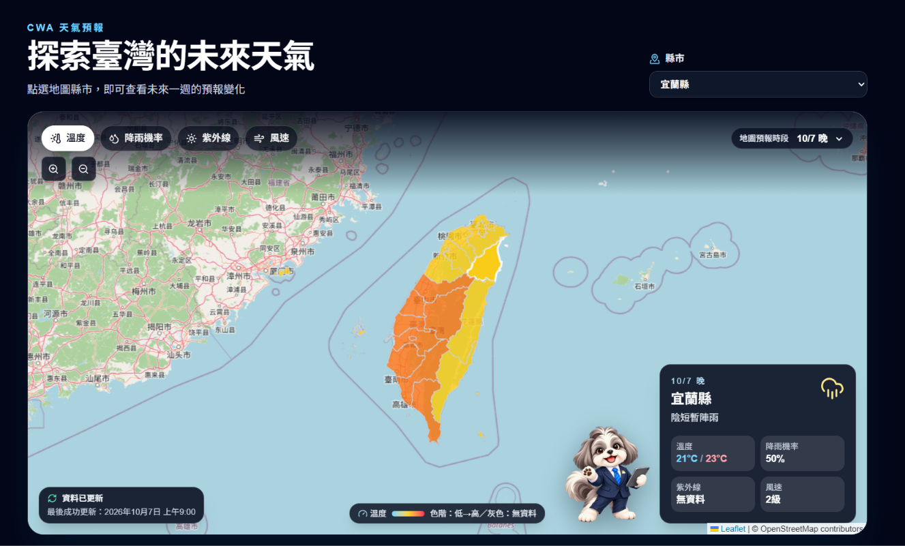
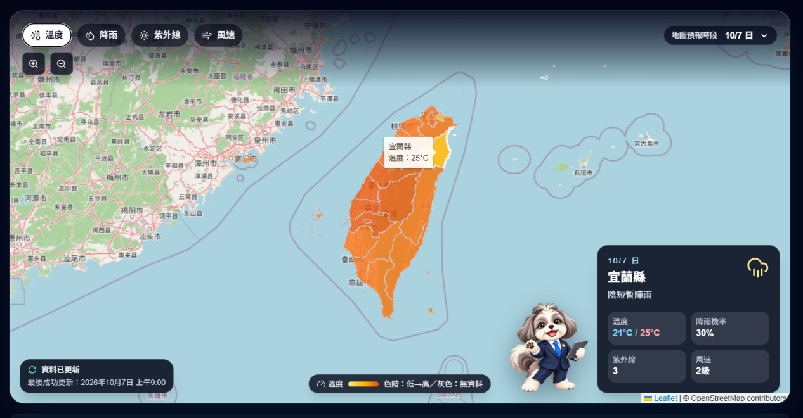
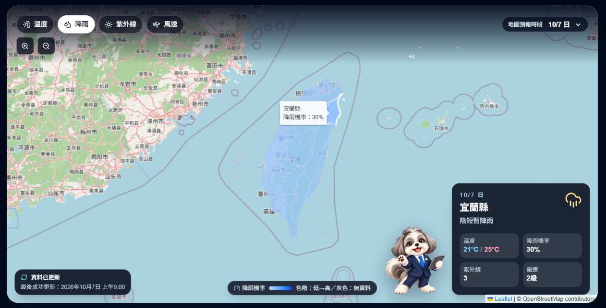
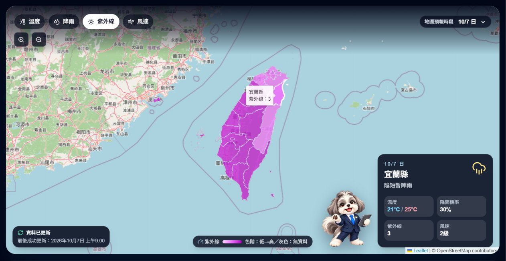
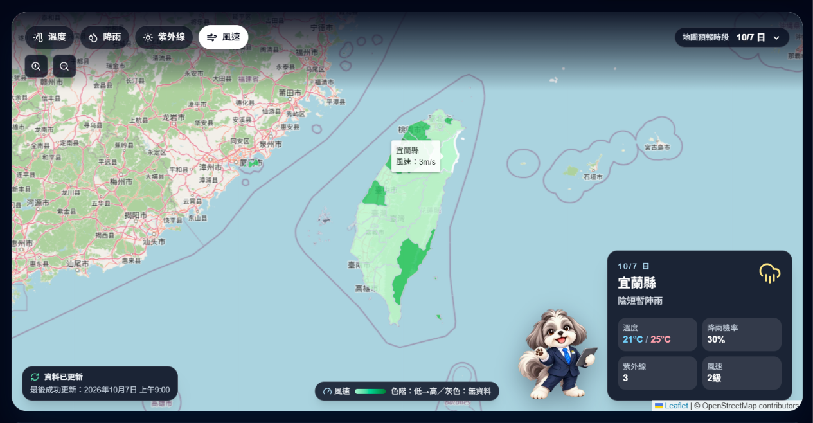
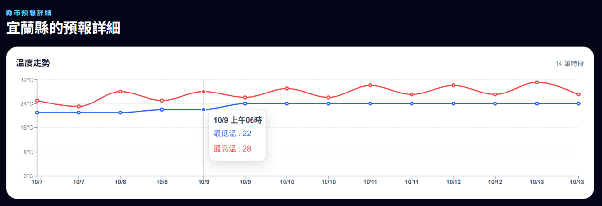
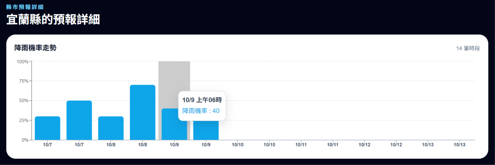
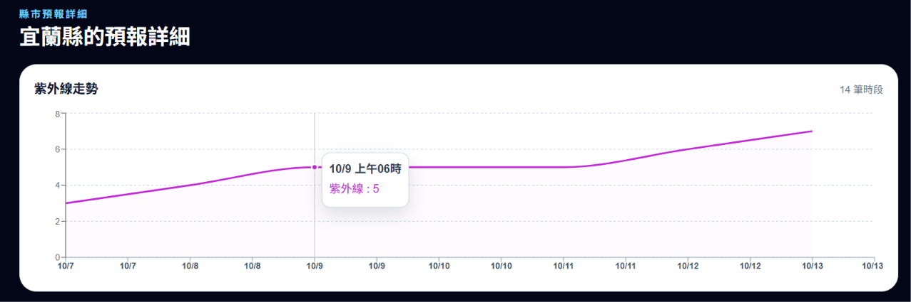
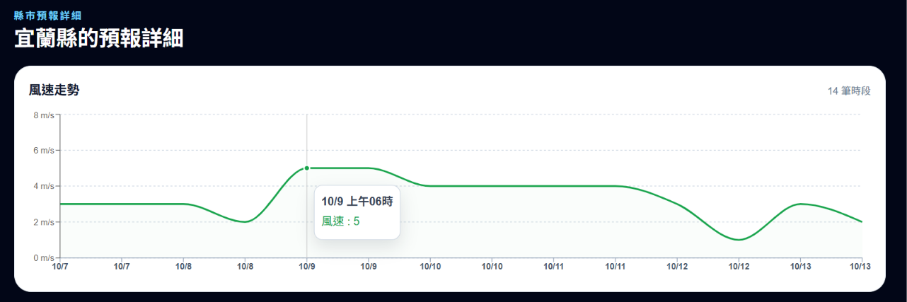
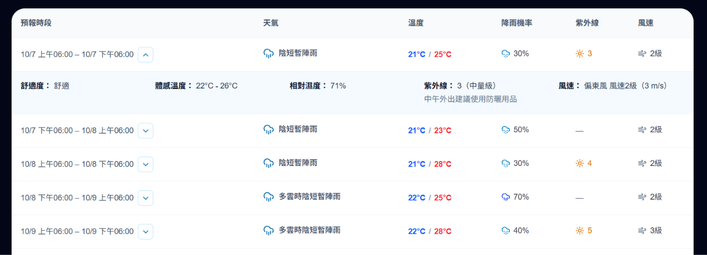

# CWA 天氣預報儀表板

以中央氣象署（CWA）開放資料打造的互動式臺灣縣市天氣預報網站。使用者可從地圖探索未來一週的縣市預報，切換溫度、降雨機率、紫外線與風速指標，並查看每個 12 小時預報時段的詳細資訊。

---

## Live Demo

[https://aiot-hw01.vercel.app/](https://aiot-hw01.vercel.app/)

 

---

## 特色

- 地圖優先的互動式儀表板：直接點選縣市即可查看該地區未來一週預報
- 12 小時預報時段導覽：地圖明確標示目前顯示的白天／晚間資料，預設為下一個可用預報時段
- 多指標地圖圖層：溫度、降雨機率、紫外線與風速可即時切換；缺漏資料會明確呈現，不會虛構數值
- 同步圖表與詳細表格：切換地圖指標時，趨勢圖同步改為對應資料
- 易讀的預報細節：天氣圖示、降雨強度圖示、最低／最高溫色彩、紫外線等級與建議、風級與展開式補充資訊
- 資料新鮮度提示：地圖左下角顯示最後成功同步時間；資料過期或同步失敗時保留上次可用資料並顯示狀態
- 無障礙替代操作：除地圖外，仍可透過縣市選單選取地區
- 受保護的管理頁面：`/admin` 需登入後才能觸發 GitHub Actions 手動同步

---

## UI / UX 導覽

### 地圖為主的探索流程

- 主視覺以臺灣地圖為核心
- 上方控制列可切換要視覺化的預報指標
- 縮放控制可調整地圖範圍大小
- 使用者點選縣市後，地圖會高亮選取區域，並帶入該縣市完整的可用預報日期範圍
- 右下角摘要卡顯示選取縣市、目前預報時段、天氣圖示、溫度區間、降雨機率、紫外線與風級

### 時段與指標同步

- 預報資料以 12 小時為一個時段
- 點選時段列時，地圖色塊、縣市摘要與下方圖表會同步更新
- 地圖選擇「降雨機率」時，詳細區域顯示降雨機率趨勢，依此類推

#### 全台溫度地圖
 

#### 全台降雨地圖


#### 全台紫外線地圖


#### 全台風速地圖


### 預報詳細資訊

以趨勢圖和詳細天氣資訊呈現每個時段：

#### 全台溫度趨勢


#### 全台降雨趨勢


#### 全台紫外線趨勢


#### 全台溫度趨勢


- 天氣欄顯示來源天氣敘述的摘要與對應圖示
- 溫度欄以藍色表示最低溫、紅色表示最高溫
- 降雨機率依高低使用不同雨滴圖示
- 紫外線欄顯示數值；展開後提供量級與防護建議
- 風速欄主列表僅顯示風級
- 預報時段右側的展開/收合圖示可查看體感溫度、舒適度、相對濕度、紫外線建議與完整風況

 

---

## 資料來源與更新頻率

| 項目 | 設定 |
| --- | --- |
| 預報資料集 | CWA `F-D0047-091` 縣市天氣預報 |
| 預報粒度 | 每筆資料為 12 小時預報時段，網站顯示可用的未來一週資料 |
| CWA 發布時間 | 每日約臺灣時間 `05:30`、`11:30`、`17:30`、`23:30` |
| 自動同步排程 | GitHub Actions 每日臺灣時間約 `05:35`、`11:35`、`17:35`、`23:35` 執行 |
| 前端查詢 | 使用者瀏覽與篩選資料時只讀取 Supabase 已儲存的預報，不會直接呼叫 CWA API |
| 手動同步 | 管理員可在 `/admin` 觸發 GitHub Actions 的 `Synchronize CWA forecast` workflow |

排程同步會從 CWA 擷取資料、正規化後寫入 Supabase PostgreSQL。網站查詢資料庫，因此能降低 CWA API 呼叫次數，並在同步短暫失敗時繼續提供上次成功的資料

---

## 系統架構

```text
CWA Open Data API (F-D0047-091)
             │
             ▼
GitHub Actions + Python ingestion
             │
             ▼
Supabase PostgreSQL ─────► Next.js Route Handlers ─────► Vercel / React UI
             ▲                                                    │
             └────────── 管理員手動同步（受保護）───────────────────┘
```

---

## 技術棧

| 類別 | 技術 |
| --- | --- |
| 前端 | Next.js 16、React 19、TypeScript、Tailwind CSS 4 |
| 地圖與資料視覺化 | Leaflet、React Leaflet、Recharts、Lucide React |
| API 邊界 | Next.js Route Handlers、Supabase PostgREST |
| 資料庫 | Supabase PostgreSQL |
| 資料擷取 | Python 3.12、CWA Open Data API |
| 排程與自動化 | GitHub Actions |
| 資料庫遷移與測試 | Supabase CLI、pgTAP |
| 前端測試 | Vitest、Testing Library、jsdom |
| 規格管理 | OpenSpec |
| 部署 | Vercel |

## 專案結構

```text
.
├── .github/
│   └── workflows/
│       └── cwa-forecast-sync.yml    GitHub Actions：依 CWA 發布時段同步預報
├── docs/
│   └── displays/                    README 使用的網站與各指標畫面截圖
├── ingestion/                       Python 資料擷取套件
│   ├── src/cwa_weather_ingestion/
│   │   ├── cwa_client.py            呼叫 CWA Open Data API
│   │   ├── parser.py                解析並正規化 F-D0047-091 回應
│   │   ├── versioning.py            建立同步紀錄、快照與資料庫寫入
│   │   ├── config.py                讀取執行環境設定
│   │   └── cli.py                   同步工作流程進入點
│   ├── tests/                       單元測試與 API fixture
│   ├── pyproject.toml               Python 套件與相依設定
│   └── README.md                    ingestion 模組補充說明
├── openspec/                        可追溯的需求與設計規格
│   ├── specs/                       目前生效的主規格
│   │   ├── forecast-dashboard/      公開儀表板行為規格
│   │   ├── forecast-data-sync/      CWA 同步與版本資料規格
│   │   ├── forecast-query-api/      預報查詢 API 規格
│   │   └── admin-forecast-operations/ 管理員操作規格
│   └── changes/archive/             已完成並封存的 OpenSpec 變更
├── supabase/                        Supabase 資料庫基礎設施
│   ├── migrations/                  PostgreSQL schema、RLS 與約束 migration
│   ├── tests/database/              pgTAP 完整性與存取權限測試
│   └── config.toml                  Supabase CLI 設定
├── web/                             Next.js 網頁應用程式
│   ├── src/app/
│   │   ├── page.tsx                 公開天氣儀表板路由
│   │   ├── admin/                   受保護的管理員頁面
│   │   ├── api/                     forecasts、locations、freshness 與 admin APIs
│   │   └── globals.css              全域樣式與 Leaflet 基礎樣式
│   ├── src/components/              地圖、預報細節、儀表板與管理 UI 元件
│   ├── src/lib/                     Supabase 存取、資料轉換、選取狀態與驗證邏輯
│   ├── public/
│   │   ├── data/taiwan-counties.geojson  臺灣縣市邊界與 CWA 區碼對照資料
│   │   └── weather_reporter*.png    網站吉祥物原圖與透明版
│   ├── scripts/                     用戶端密鑰與 GeoJSON 檢查腳本
│   ├── package.json                 前端指令與相依套件
│   └── vitest.config.ts             前端測試設定
├── .env.example                     環境變數範本（不含真實密鑰）
├── requirement-list.md              專案需求清單
└── README.md                        專案總覽、操作、部署與驗證說明
```

### 主要資料流程

1. GitHub Actions 依排程執行 `ingestion`，以 `CWA_API_KEY` 取得 CWA 預報。
2. Python 解析器將回應正規化並透過 `SUPABASE_DB_URL` 寫入 Supabase。
3. Next.js Route Handlers 以伺服器端 Supabase Secret key 查詢已保存的資料。
4. 瀏覽器只呼叫本站的 API，並以 Leaflet 與 Recharts 呈現地圖、圖表與表格。
5. `/admin` 透過受保護路由觸發 GitHub Actions 手動同步；前端不會取得 CWA 或 Supabase server key。
---

## 本機啟動

### 前端

建立 `web/.env.local`：

```env
SUPABASE_URL=https://<project-ref>.supabase.co
SUPABASE_SECRET_KEY=sb_secret_...
```

```powershell
cd web
npm.cmd install
npm.cmd run dev
```

開啟 [http://localhost:3000](http://localhost:3000)。

> 請勿把任何 Supabase Secret key 或 CWA API key 加上 `NEXT_PUBLIC_` 前綴，也不要提交到 Git

### 管理員手動同步

若要於本機使用 `/admin`，還需在 `web/.env.local` 加入：

```env
ADMIN_PASSWORD=<strong-password>
ADMIN_SESSION_SECRET=<random-secret-at-least-32-characters>
GITHUB_ACTIONS_SYNC_TOKEN=<fine-grained-github-token>
GITHUB_REPOSITORY=<owner>/<repository>
GITHUB_SYNC_REF=main
```

`GITHUB_ACTIONS_SYNC_TOKEN` 需對目標 repository 具備 **Actions: Read and write** 權限，才能觸發 workflow

GitHub Actions repository secrets：

```text
CWA_API_KEY
SUPABASE_DB_URL
```

`SUPABASE_DB_URL` 使用 Supabase **Transaction pooler** PostgreSQL URI，適合 GitHub Actions 的 IPv4 runner 與短生命週期同步工作

## 驗證

```powershell
# Database
npx.cmd supabase@latest test db

# Python ingestion
cd ingestion
py -3.12 -m unittest discover -s tests -v

# Frontend
cd ../web
npm.cmd run lint
npm.cmd run test
npm.cmd run check:client-secrets
npm.cmd run build
```
